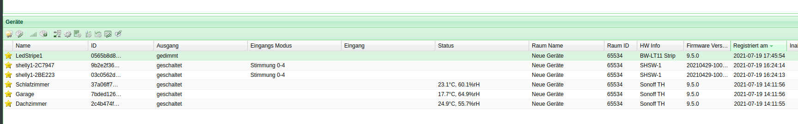

# External Device for plan44's vdcd to bridge between Digitalstrom and other Devices

Disclaimer: Work in Progress =)

This Golang based project allows to integrate existing smart devices (specially lights and relays) into the [digitalSTROM](https://www.digitalstrom.com/) system. The project uses the free virtual device connector (vdc) from [plan44](https://github.com/plan44/vdcd).

Currently the following devices are supported:
* [Tasmota](https://github.com/plan44/vdcd) based relays. Uses MQTT for discovery and control of the device
* [Shelly](https://shelly.cloud/) based relays. Uses MQTT for discovery and control of the device.



## How to

### 1. start a vcdc

Clone the vdcd project:

`git clone https://github.com/plan44/vdcd.git`

Build the container image:

```

cd vdcd
docker build -t myImageName .
```

Start the vdcd:

```
 docker run --network=host -v /var/run/dbus:/var/run/dbus -v /var/run/avahi-daemon/socket:/var/run/avahi-daemon/socket myimagename vdcd --externaldevices 8999 --externalnonlocal
```

### 2. Start the vdcd Brige

Clone the vdcd-bridge Project

`git clone https://github.com/splattner/vdcd-bridge.git`

Build the binary:

```
cd vdcd-bridge
go build .
```

Start the vdcd bridge:

`./vcdc-bridge -H ipofvdcdhost --mqtthost ip:portmqttbroker`

or as a container:

Build the container:

`docker build -t myimagename .`

Start the vcdc-brige as a container:

`docker run myimagename vdcd-bridge -H ipofvdcdhost --mqtthost ip:portmqttbroker`